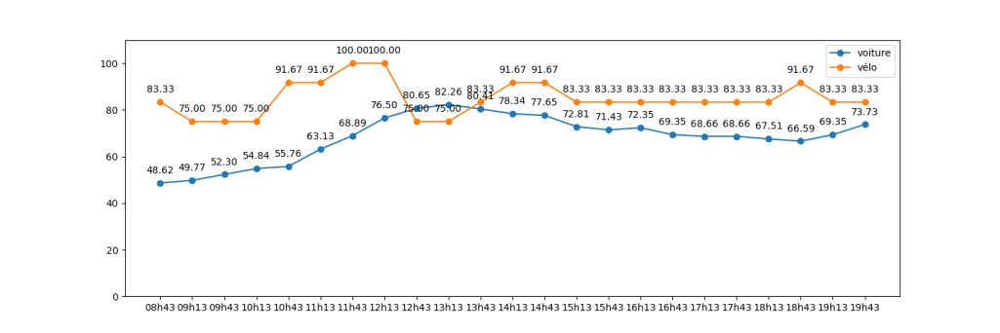

## Compte rendu Projet - Matéo Lhuissier & Jules Morice
---

Notre projet consiste à récupérer des données de parkings de voitures et de vélos de Montpellier pour faire une analyse pour la Mairie.


Lien du Github : https://github.com/Addon-cmd/SAE15_JulesMorice_Mat-oLhuissier

Lien du site d'analyse: https://addon-cmd.github.io/SAE15_JulesMorice_Mat-oLhuissier/
  

- [Partie 1 - Récupération des données](#partie-1---récupération-des-données)
- [Partie 2 - Analyse des données](#partie-2---analyse-des-données)

# Partie 1 - Récupération des données

La première chose à faire pour réaliser notre projet est de récupérer les donénes des parkings.
Pour cela nous avons tout d'abord créer un module pour récupéré les données des parkings et des vélos de Montpellier.

Nous avons commencé par les parkings: 

```python

#Noms des parkings de montpellier
parkings=['FR_MTP_ANTI','FR_MTP_COME','FR_MTP_CORU','FR_MTP_EURO','FR_MTP_FOCH','FR_MTP_GAMB','FR_MTP_GARE','FR_MTP_TRIA','FR_MTP_ARCT',
'FR_MTP_PITO','FR_MTP_CIRC','FR_MTP_SABI','FR_MTP_GARC','FR_MTP_MOSS','FR_STJ_SJLC','FR_MTP_MEDC','FR_MTP_OCCI','FR_CAS_VICA','FR_MTP_GA109','FR_MTP_GA250','FR_CAS_CDGA','FR_MTP_ARCE','FR_MTP_POLY'] 


#fonction qui permet de suivre l'occupation d'un parking en particulier (un dans le tableau ci-dessus) et qui enregistre le résultat dans un fichier txt
def parking(nomParking,nomFichier):
    
    date=time.time()
    response=requests.get("https://data.montpellier3m.fr/sites/default/files/ressources/"+nomParking+'.xml')
    f1=open(nomParking+".txt","w", encoding='utf8') #Creation d'un fichier txt s'il n'existe pas, sinon l'ecrase et l'ouvre en mode ecriture 
    f1.write(response.text) #ecriture de la requete dans le fichier txt 
    f1.close() #fermeture du fichier 

    tree = etree.parse(nomParking+".txt")

    for user in tree.xpath("Status"):
        if user.text=='Open':
            date = time.strftime('%d-%H_%M_%S', time.localtime(date))
            for user in tree.xpath('Free'):
                free=int(user.text)
            for user in tree.xpath('Total'):
                occupation=100-round((free/int(user.text))*100,2)
                f1=open(nomFichier+'.csv','a', encoding='utf8')
                f1.write(f"{date},{str(free)},{str(user.text)},{str(occupation)} \n")
                
                f1.close()
```

Grâce à cette fonction, nous pouvons récupéré les données d'un parking (il suffit de renseigner le nom de celui-ci et le nom du fichier dans lequel les données seront sauvegarder).
Nous pouvons adapter le format de sauvegarde dans le fichier csv.

<br>
Ensuite nous avons fait la fonction pour récupérer les données sur les vélos:

```python
def velo(nomFichier):

    ParkVelo=requests.get(f"https://montpellier-fr-smoove.klervi.net/gbfs/en/station_status.json")
    f1=open(f"ParkVelo.json","w", encoding='utf8') # J'ouvre mon fichier txt de chaque parkings en ecriture format utf8
    f1.write(ParkVelo.text) # j'ecrit dans mon dossier les infos que je recupere du site 
    f1.close() # je ferme mon fichier

    fileObject = open("ParkVelo.json", "r")
    jsonContent = fileObject.read()
    aList = json.loads(jsonContent)
    free=(aList['data']['stations'][10]['num_bikes_available'])
    total=(aList['data']['stations'][10]['num_docks_available'])
    date=(aList['data']['stations'][10]['last_reported'])
    date = time.strftime('%d-%H_%M_%S', time.localtime(date))

    occupation=100-round((free/(total+free))*100,2)
    f1=open(nomFichier+'.csv','a', encoding='utf8')
    f1.write(f"{date},{str(free)},{str(int(total))},{str(occupation)} \n")
    f1.close()
    fileObject.close()
```

Grâce à cette fonction, nous pouvons récupérer les données d'un parking vélo (grâce à l'id de celui-ci).
On pourrait imaginer un tableau (comme celui pour les parkings voiture) comprenant le nom des différents parkings vélos. En faisant la correspondance avec l'id, on pourrait récupéré les données de n'importe quel parkings vélo, comme pour les parkings voiture.
Ce n'est pas ce que nous avons fait car nous avons seulement fait l'étude d'un seul parking vélo.
Les données sont enregistrées dans un fichier csv.

<br>
Maintenant que nous avons notre librairie avec nos deux fonctions, nous pouvons construire une fonction `main` pour enregistrer les données d'un parking et d'un parking vélo simultanément, avec une période et avec une durée choisit. 

```python
import parkings_velos
import time
def main(duree,periode):
    nbrboucles=duree/periode #Je calcule le nombre de boucles qu'il faudra réaliser en fonction de la durée et de la periode
    for i in range(int(nbrboucles)):
        parkings_velos.parking('FR_MTP_ANTI','voiture') #Appel de la fonction parking
        parkings_velos.velo('velo') #Appel de la fonction vélo
        time.sleep(periode) #Periode

main(300,60) #ici pour le test nous avons pris une durée de 300 secondes (5 minutes) et une période de 60 secondes (1 minutes).
```

On constate que notre programme fonctionne, nos fichiers contiennent bien les données:

Vélos:
```
date_derniere_maj,libre,total,occupation
18-11_41_49,2,10,80.0 
18-11_41_49,2,10,80.0 
18-11_41_49,2,10,80.0 
18-11_41_49,2,10,80.0 
18-11_41_49,2,10,80.0 
```

Voitures:
```
date_derniere_maj,libre,total,occupation 
18-11_42_01,128,0239,46.44 
18-11_43_02,128,0239,46.44 
18-11_44_02,128,0239,46.44 
18-11_45_09,128,0239,46.44 
18-11_46_10,128,0239,46.44 
```

Nous pouvons maintenant récupérer les données sur une longue durée pour faire une analyse.

Nous avons choisi le parking "Gambetta" et le parking vélo "Plan cabane" car ils sont proche l'un de l'autre (environ 50 mètres).


Nous avons décidé de faire une analyse sur plusieurs jours dont au moins un jour de weekend et un à plusieurs jours en semaine. Notre programme s'exécute pendant plusieurs heures (environ 5 à 10 heures par jours).

Nous avons réaliser une analyse mercredi 18 janvier de 16h à 18h30 environ. 

Notre deuxième analyse à été faite le lendemain, le jeudi 19 janvier (jour de grève ce qui peux amener à des résultats différents) de 7h à 14h environ.

Une troisième analyse à été réalisée le vendredi 20 janvier de 7h à 17h environ.

Et enfin notre dernière analyse à été faite le 21 janvier de 8 heure à 20 heure environ.

# Partie 2 - Analyse des données

Maintenant que nous avons récupéré les données des parkings, il faut les analyser. Pour cela nous avons utilisé une librairie créée par nous même plus tôt durant la Saé. 

Cette librairie comprends des calculs de moyenne, écart type et autres, tout cela à partir d'une liste.

Notre fichier étant un csv, il nous faut d'abord convertir celui-ci en liste.

Ce qui nous intéresse à analyser est le taux d'occupation (calculé en même temps que la récupération des données).  C'est donc le taux d'occupation que l'on va mettre dans notre liste.

Pour cela on utilise le code suivant:

```python
import csv
def csv_to_list(nomFichier):
    liste=[]
    with open(nomFichier+".csv", 'r') as fichier:
    # Création d'un lecteur CSV
        lecture = csv.reader(fichier)
    # Boucle sur chaque ligne du fichier
        
        for ligne in lecture:
            # Ajout de la ligne à la liste
            liste.append(ligne)
    return liste
```

Cette fonction va permettre de réaliser une liste de listes, chacune comprenant une ligne du fichier csv (soit les données récupérés à un moment donné.) 

```python 
print(csv_to_list('velo'))
```

```
[['21-08_10_58', '2', '10', '83.33'], ['21-08_38_21', '2', '10', '83.33'], ['21-09_11_02', '3', '9', '75.0 '], ['21-09_38_27', '3', '9', '75.0 '], ['21-10_11_06', '3', '9', '75.0 '], ['21-10_38_33', '1', '11', '91.67'], ['21-11_11_10', '1', '11', '91.67'], ['21-11_38_39', '0', '12', '100.0'], ['21-12_08_11', '0', '12', '100.0 '], ['21-12_35_27', '3', '9', '75.0 '], ['21-13_08_16', '3', '9', '75.0 '], ['21-13_36_34', '2', '10', '83.33 '], ['21-14_05_37', '1', '11', '91.67 '], ['21-14_35_39', '1', '11', '91.67 '], ['21-15_05_42', '2', '10', '83.33 '], ['21-15_35_45', '2', '10', '83.33 '], ['21-16_05_50', '2', '10', '83.33 '], ['21-16_35_52', '2', '10', '83.33 '], ['21-17_05_55', '2', '10', '83.33 '], ['21-17_35_57', '2', '10', '83.33 '], ['21-18_06_00', '2', '10', '83.33 '], ['21-18_36_03', '1', '11', '91.67 '], ['21-19_10_57', '2', '10', '83.33 '], ['21-19_36_11', '2', '10', '83.33 ']]
```

Nous allons donc pouvoir réutiliser cette fonction pour nos calculs, car la librairie traite des listes.

Pour avoir une liste avec tout les taux d'occupation d'une journée, il faut créer une liste avec ceux-ci.
Pour cela on utilise la fonction suivante:

```python
def moyenneCSV(nomFichier):
    liste_occupation=[]
    liste= csv_to_list(nomFichier)
    for i in range(0,len(liste)):
            liste_occupation.append(liste[i][3])
    return stats.moyenne(liste_occupation)
```
Par exemple pour la moyenne, on créer une liste et on y insère tout les taux d'occupation, puis on calcul la moyenne de cette liste. 

On peut donc réaliser cette technique pour tout les calculs de liste que l'on souhaite.

La réalisation de courbes dans notre projet est crucial. En effet, il est important de bien présenter nos données, et pour cela un graphique avec des courbes bien présentées sont essentielles.
Nous utilisons la librairie matplotlib pour réaliser cela.

```python
import matplotlib.pyplot as plt


#Affiche une courbe avec l'axe des X en premier, puis l'axe des Y, puis en option une 2eme courbe 
def courbe(axe_x,axe_y,axe_y2=0):
    plt.plot(axe_x,axe_y,axe_y2)

    plt.show()
```

Nous sommes partis de cette fonction qui permet d'afficher un graphique avec une ou deux courbes à partir de listes. A cela nous avons ajoutés des variations dans cette fonction pour réaliser des graphiques plus présentables et compréhensibles.

Notre fonction finale est la suivante:

```python
def courbe(axe_x,axe_y,axe_y2=0):
    plt.ylim([0, 110])
    
    plt.plot(axe_x,axe_y,marker="o",label="voiture")
    plt.plot(axe_x,axe_y2,label="vélo",marker="o")
    plt.legend()

    for x,y in zip(axe_x,axe_y):

        label = "{:.2f}".format(y)

        plt.annotate(label, 
                    (x,y), 
                    textcoords="offset points", 
                    xytext=(0,10), 
                    ha='center') 
    for x,y in zip(axe_x,axe_y2):

        label = "{:.2f}".format(y)

        plt.annotate(label,
                    (x,y), 
                    textcoords="offset points",
                    xytext=(0,10), 
                    ha='center') 
    plt.show()
```
Nous avons ajouté des modifications à l'esthétique des courbes, comme les points à chaque donnée, les noms correspondant aux courbes,... (Les titres des axes et du graphique étants rajoutés sur le site)

Comme pour les calculs des statistiques, nous devons adapter ce programme pour un fichier csv.
Nous avons décidé de faire un graphique par jour. Il nous faut donc afficher deux courbes par graphique.
Ce programme permet donc de transcrire les deux fichiers csv d'un même jour à un graphique comportant deux courbes (vélo + voiture).

```python
def courbeCSV(nomFichier1,nomFichier2):
    liste_occupation=[]
    liste_occupation2=[]
    liste_date=[]
    liste= csv_to_list(nomFichier1)
    liste2= csv_to_list(nomFichier2)
    for i in range(0,len(liste)):
        date=liste[i][0]
        heure= date[3:5] + 'h' + date[6:8]        
        liste_date.append(heure)
        liste_occupation.append(round(float(liste[i][3]),2))
    for i in range(1,len(liste2)):     
        liste_occupation2.append(round(float(liste2[i][3]),2))
    return stats.courbe(liste_date,liste_occupation,liste_occupation2)
#print(courbeCSV("voiture4","velo4")) #Appel de fonction
```


Nous arrivons maintenant à générer des graphiques et à calculer des statistiques sur le taux d'occupation des parkings vélo et voiture. Cela nous permet donc de faire des analyses et de les présenter sur un site.

